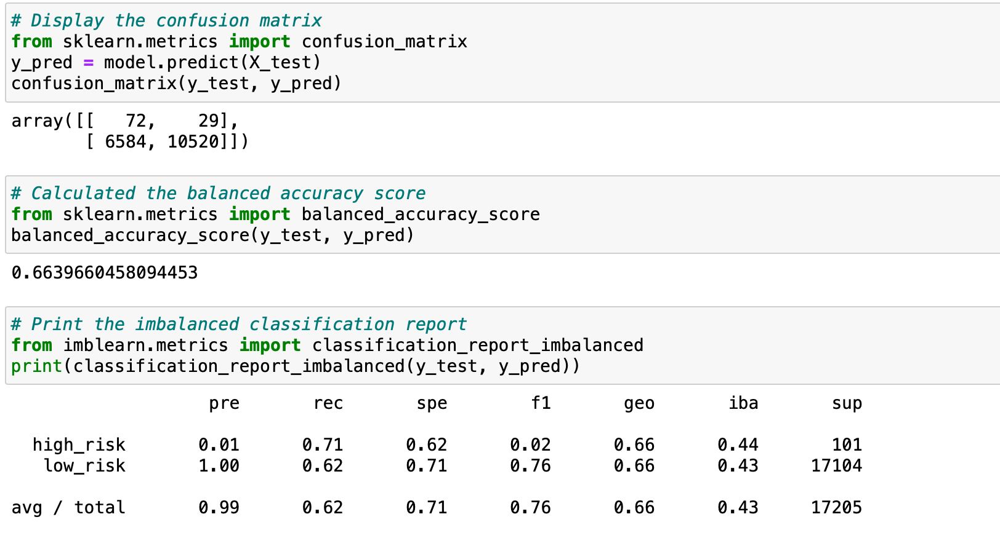
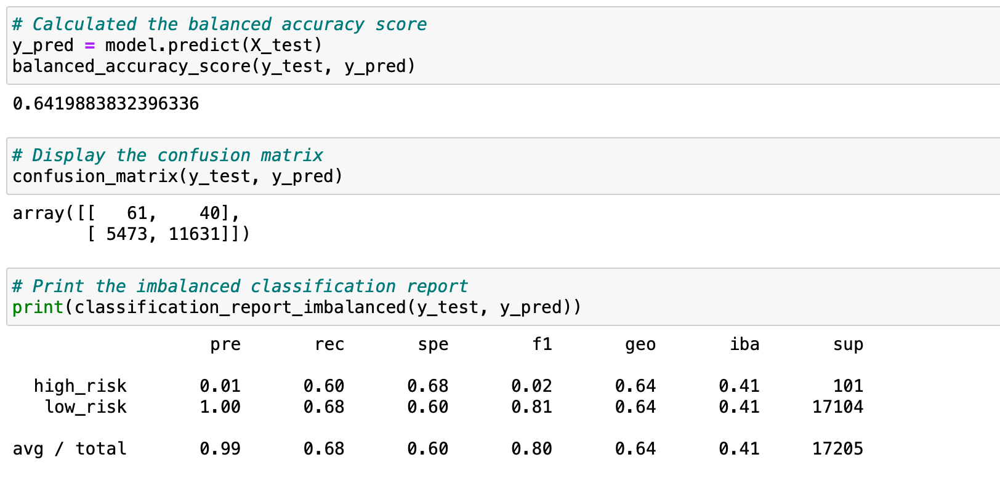
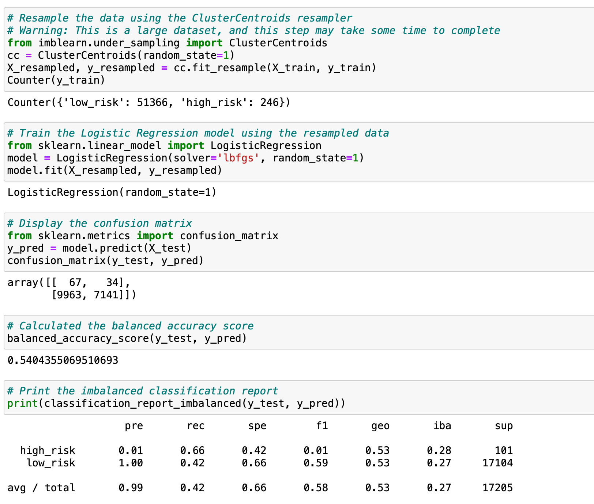
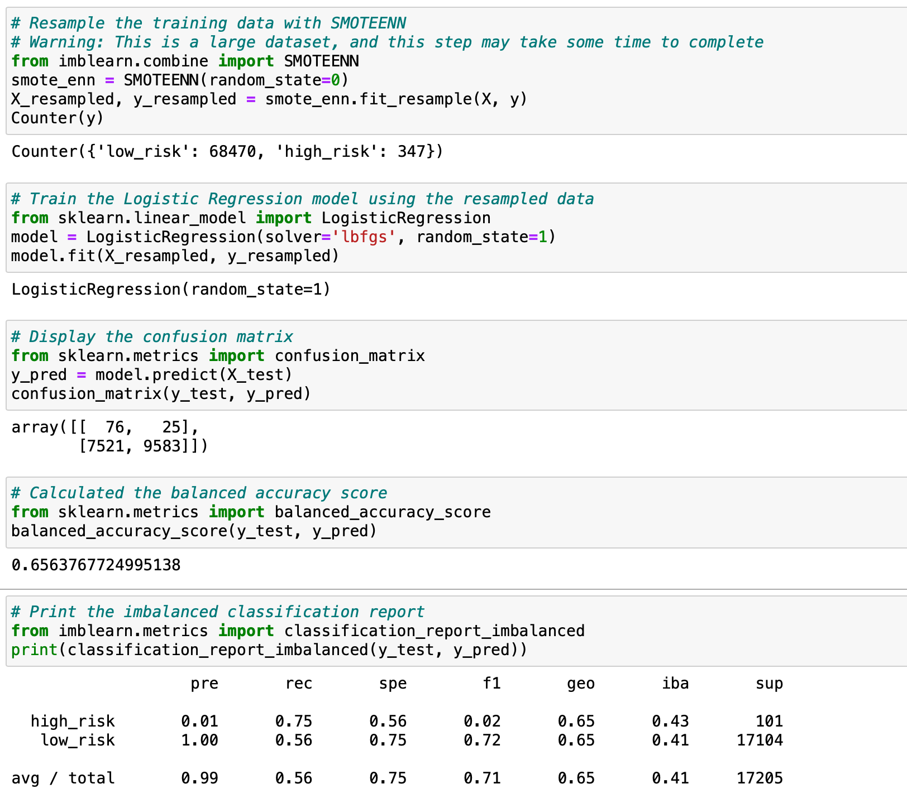
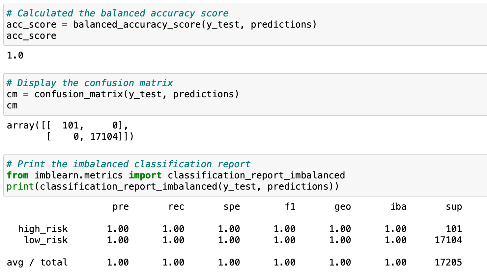
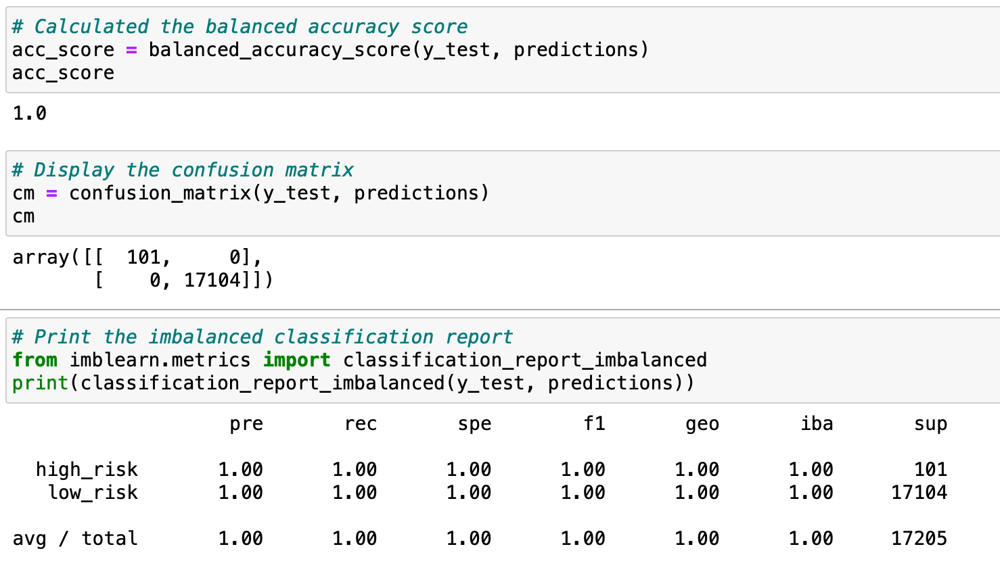

# Credit_Risk_Analysis

## Overview of the Analysis
In this analysis I used many machine learning algorithms to determine credit card risk. The data set consisted of over 85 Columns all variables to consider while working with the data set. The set of course had to be cleaned and organized then scaled to be numerical to be able to work with the machine learning algorithms. After cleaning the process was smooth. You write some code, gather results, compare and retest with another model or with different parameters.
## Results

#### Random Over Sampler Results

#### SMOTE Results

#### Cluster Centroids Results

#### SMOTEENN Results

#### Balanced Random Forest Results

#### Adaptive Boost Ensemble Results

## Summary
The results of the machine learning models are above, if I were to recommend a model to use I would stick with the RandomOverSampler model. Not only is it simple but it doesn't over classify the data or skew it in any way by trying to balance the data.